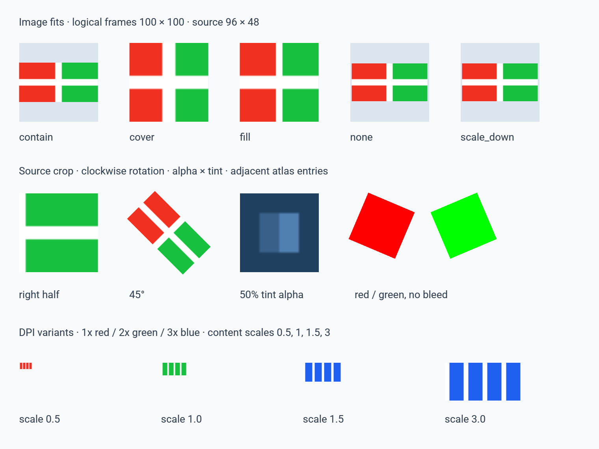

# Images and assets

Custom images use fractional logical frames, a shared image atlas per drawing
context, and explicit density variants. Run the fixture with:

```sh
v -d ui2_custom_rendering run examples/image_assets
make screenshot EXAMPLE=image_assets
```

The fixture includes five fits, cropping, clockwise rotation, transparent tint,
adjacent red/green atlas entries and density variants. Its small PNGs are
independent geometric/color fixtures, with no external asset dependencies.
The reference capture below uses macOS custom GL at device scale 2; the same
760 × 570 logical fixture was inspected under Linux Xvfb/llvmpipe at scale 1.
The DPI row therefore selects red/green/blue/blue on macOS and red/red/green/blue
on Linux. Captures establish visual behavior; separate runtime tests verify
resource release and normal close.



```v
photo := ui2.Element{
    ...ui2.image('photo', 'assets/photo.png', ui2.rect(10.25, 20.5, 240, 160))
    image_style: ui2.ImageStyle{
        fit: .cover
        align_x: 0.5
        align_y: 0.5
        source: ui2.rect(0, 0, 1, 1)
        tint: ui2.ImageTint{r: 255, g: 192, b: 128, a: 200}
    }
    image_asset: ui2.ImageAsset{
        logical_size: ui2.LayoutSize{width: 240, height: 160}
        variants: [
            ui2.ImageVariant{path: 'assets/photo@2x.png', density: 2},
            ui2.ImageVariant{path: 'assets/photo@3x.png', density: 3},
        ]
    }
    rotation: 15
}
```

`image_path` is the 1x base source; variants are explicit files. PNG/JPEG and the
other formats supported by the pinned stb decoder load through the same manager,
including button images. SF Symbols remain the existing native/symbol text path.
Image styling is a V API in this compiler revision; VML grammar expansion belongs
to the compiler lowering work. Use `on_event` together with `clickable` or
`draggable` for image input.

| Fit | Behavior |
| --- | --- |
| `.contain` (default) | Largest proportional image fully inside the frame; letterboxing. |
| `.cover` | Smallest proportional image filling the frame; source UVs crop overflow. |
| `.fill` | Stretch the selected source to both frame dimensions. |
| `.none` | Keep the source's logical intrinsic size; crop overflow to the frame. |
| `.scale_down` | Contain, capped at intrinsic size. |

Alignment values range from 0 (left/top) to 1 (right/bottom). Source rectangles
are positive normalized bounds inside the full image, and apply before fitting.
Rotation is clockwise in degrees about the **declared frame center**, after fit
and source cropping. It leaves layout unchanged and can extend beyond the frame;
ancestor Scroll/ScaledContent clipping still applies. Transparent pixels belong
to the visible quad's hit region; letterboxes and corners outside the rotated
quad do not. Boundaries are inclusive. Painting and hit testing use the existing
`ContentTransform` once, with device DPI applied only at presentation. Image
vertices retain fractions and are not independently snapped to pixel edges.

Tint multiplies each straight RGBA channel by the corresponding 0..255 tint
channel. The result uses source-over blending: source RGB times resulting alpha
plus destination RGB times its complement. Transparent pixels stay transparent;
tint alpha 0 paints nothing. It does not change rectangular hit membership.

Variants require `logical_size`, which also supplies opted-in intrinsic layout
measurement when frame dimensions are zero. The logical size and aspect ratio
stay constant across variants. Pixel dimensions must match logical size × density
within one pixel. Selection picks the smallest adequate density, or the largest
available, using device DPI × ScaledContent scale × fitted enlargement. Cover and
nonuniform fill account for the larger sampling footprint. Rotation does not
change uniform sampling density. Variant order has no effect.

No variants means decoded pixel dimensions are the logical intrinsic size unless
`logical_size` is supplied. A missing/invalid selected file paints the existing
placeholder and has no image hit target. There is no silent fallback to a
potentially stale variant. Change the declaration and call `refresh()` to retry.
Changes to file size/mtime invalidate its cached entry on the next frame. Bump
`ImageAsset.revision` for same-size replacements within timestamp resolution.
Paths/revisions are context-local identities; changing a path, revision or selected
density retires the unused entry after submission. Invalid dimensions and native
presentation settings produce diagnostics.

Small images share 512 × 512 RGBA pages. Each entry has two extruded edge texels,
including alpha and corners; linear filtering and no mipmaps prevent atlas
neighbor bleeding. Larger images get an appropriately sized page within the GPU
texture limit. Slots append; a live page is never repacked or overwritten. Dirty
pages upload once before the frame's pass. The complete declared tree marks
consumers, including culled images. Removing one shared consumer retains its
entry. After submission, unused entries retire and empty pages release textures
and samplers. Closing the context releases every page and its blend pipeline;
recreation starts with fresh handles. Resize preserves the owner and only changes
variant selection when its sampling footprint changes.

`ui2.image_resource_stats()` reports actual decodes, cache hits, page uploads,
created/destroyed pages and currently retained entries/textures/samplers for the
active custom window. Native/closed windows return zero. It does not request a
frame. The resource tests exercise real GPU submission and normal teardown;
capture termination alone does not establish teardown or idle behavior.

Native AppKit/UIKit support the simple centered proportional static image.
All native profiles reject image rotation and interaction (callbacks, pointer
flags, cursor, menu or tooltip), because the visible-quad input contract requires
custom rendering. Configure rotation and interaction through Element fields; the old
`transformed_image`/`transformed_image_with_cursor` factories are removed.
Native profiles also reject custom fit/source/tint/alignment and DPI assets.
Windows native accepts BMP Image with explicit `ImageStyle{fit: .fill}`, zero
rotation and no asset configuration. Its bitmap control rejects the default
proportional fit, crops, tint and DPI variants; use custom rendering for those. Backend
cross-checks are typechecks, not native runtime acceptance on those hosts.

This work does not package or distribute embedded assets. General affine
transforms and exact transformed ancestor clips are owned by PR 20; this branch
uses the uniform scale/translation seam present in its fixed base. Combined
rotated ancestors, vector geometry and drag previews require integration tests
against that implementation before claiming shared acceptance.
